# PR01-02 Embedding 后续实验研究报告

日期：2026-10-09。版本：EMB-next-1；以本报告和 `next_round/` 运行证据补充首轮 `../REPORT.md`，首轮结果未被覆盖。

## 1. 本轮回答的问题与结论范围

传统 STREME 主线从序列保守性发现候选模式；本分支考察冻结 DNA 模型的上下文表示能否提供额外发现价值。研究单位是短 DNA 模式及其可追溯实例，不是启动子分类准确率。Embedding 聚类必须返回实际 DNA 片段、构建位置权重矩阵（PWM），再在独立序列中扫描与检验，才能讨论模式发现。

本轮完成定位稳定性诊断、GC 与 Shuffle 诊断、聚合权重代数核验、六物种 A2 三种子实验、A0 数值实现对照，以及九类合成条件的难度与窗口消融。当前没有证据支持 Embedding 稳定优于 One-hot 或传统 STREME 的总体额外发现价值；也没有新增功能确认的启动子调控 Motif。

三个较明确的认识是：（1）聚类抽取的建模片段与固定 PWM 的独立扫描位点是不同对象，稳定性必须分别报告；（2）覆盖比例加权 A2 在大多数内部窗口与 A0 数学等价，不能把它描述成全面去除窗口外信息；（3）改善依赖窗口宽度、模式退化和背景，强模式的小幅改善不能外推到真实数据整体性能。

## 2. 冻结输入与实现

复用 `data/processed/pr01_02_data_v2` 的六物种 TJU 主数据及已有 leakage_group 划分；不重下载、不重划分、不增加新天然负样本。共有 9708 条正序列、8641 条天然负序列，Discovery 正序列 6745 条。真实序列长度为 81 bp，TSS 是 1-based 第 61 位（0-based 索引 60）。上游 RegulonDB 的 101-bp Gold 是另一数据层，不能与本轮 TJU 输入混称。

Discovery 只用正序列构建表示、PCA、聚类和 PWM；天然 Discovery 负序列用于冻结零阶背景与阈值。Development 用于诊断和比较，因反复使用只能视为探索性验证。Embedding 分支未使用真实 Holdout 评价；图 F01 的 Holdout 仅为冻结数量。已有主线是否曾查看 Holdout 不改变本分支的声明范围。

模型是冻结 `neuralbioinfo/prokbert-mini`，revision `feb2520a43cd9cdb5b3d8477e47209dbcb55d1dc`，远程代码 revision `366d9336b6b89d7c1feddf56d9b01be8065ccc43`。首轮加载报告没有 missing/unexpected/mismatched keys，权重 SHA256 为 `19ede01f2ef0420e111c0be8879357fba23332fad88a27571bd8d9b3b04bca3b`。本轮复用按顺序 sequence_id 与哈希绑定的 L6 token 缓存。81-bp 序列有 76 个 stride=1 的 6-mer token，每个 hidden state 为 384 维。本轮没有微调、没有 SAE、没有 GPU 实验。

运行环境与版本见各 manifest：Python 3.13.5 / Torch 2.7.1 CPU / Transformers 5.8.0。真实实验窗口 10 bp、PCA 24 维、MiniBatchKMeans 24 簇、n_init=5、种子 20261005/06/07；每簇每条启动子只取离中心最近的一个窗口，至少 20 条启动子，构建 PWM 后按全宽 RC-aware cosine 0.95 去重。One-hot 与 Embedding 共用发现与验证流程；STREME 是已有固定主线候选，候选预算、发现目标不同，不按显著候选总数给方法排优劣。

## 3. 评价口径

真实数据采用自定义 PWM 最大 log-odds 双链扫描，每条序列每个 PWM 只保留最大分位点。固定对称零阶 Discovery 天然背景；阈值是 Discovery 天然负样本最大分分布的第 95 百分位，命中条件严格为 score > threshold。它不是 FIMO 的 p/q，也不等于统计显著的单个位点。

天然富集以 leakage_group 为统计单位，组内 presence 取最大；共享混合标签组排除；Fisher 单侧检验。Shuffle 对照通过冻结的原序列—二核苷酸重排关系配对，组级 discordant pairs 做单侧二项检验。两类背景单独 BH。`q_original` 保留旧固定检验族；`q_new_exploratory` 是追加 A2 后、每个种子和每类背景分别校正的新探索检验族，不替换正式主线或首轮 q。

PWM 跨种子采用 Hungarian 一对一家族匹配，同时保留全宽匹配与最小 6 列局部匹配。核心描述以全宽 cosine≥0.8 为筛选，各阶段必须有共同 sequence_id。位置比较分别给出忽略方向的物理起点、包含 PWM 对齐方向的起点、±0/1/2/3 bp 容差与区间 IoU。相同家族在不同种子配对中重复出现，这些配对不是独立生物学重复，不据此计算正式置信区间或显著性。

## 4. 定位稳定性：先区分测量对象

以下为 A0 六物种、三个随机种子、全宽 cosine≥0.8 的家族配对中位数。构建片段有 280 个合格家族配对，Development 扫描有 263 个；两阶段分母不同。

| stage | tolerance_bp | paired_families | position_only_median | direction_aware_median | uniform_null_median |
| --- | --- | --- | --- | --- | --- |
| development_scans | 0 | 263 | 0.1642 | 0.1579 | 0.0041 |
| development_scans | 1 | 263 | 0.3333 | 0.3056 | 0.0124 |
| development_scans | 2 | 263 | 0.3913 | 0.3600 | 0.0219 |
| development_scans | 3 | 263 | 0.4250 | 0.3721 | 0.0295 |
| discovery_instances | 0 | 280 | 0.0054 | 0.0011 | 0.0013 |
| discovery_instances | 1 | 280 | 0.0173 | 0.0019 | 0.0040 |
| discovery_instances | 2 | 280 | 0.0304 | 0.0033 | 0.0063 |
| discovery_instances | 3 | 280 | 0.0465 | 0.0044 | 0.0084 |

建模片段的精确位置 Jaccard 约 0.0054，允许 ±2 bp 后约 0.0304；固定 PWM 的 Development 扫描分别约 0.1642 和 0.3913。加入方向约束会改变数值，因此不能只展示最有利的定义。小幅偏移解释了部分扫描不一致，却不能解释建模片段全部不稳定。PWM 相似度高并不保证来自同一批、同一位置的 DNA 片段。

诊断同时保存 ±全范围偏移、近 TSS（距离≤15 bp）与其他位置、扫描阈值、每侧位点数、原特征空间聚类中心 cosine/L2。聚类中心比较没有假定 hidden vector 存在已知 RC 变换，因此只作描述。200 次均匀随机位置和保持边缘位置分布的经验重排基线用于参照，不当作正式 p 值。One-hot 六物种三种子与 A1 枯草芽孢杆菌三种子也有逐家族数据；A1 其他物种首轮只有单种子，不能声称完成六物种 A1 三种子稳定性。

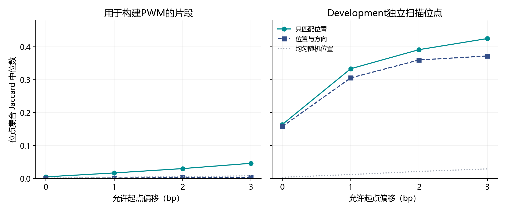

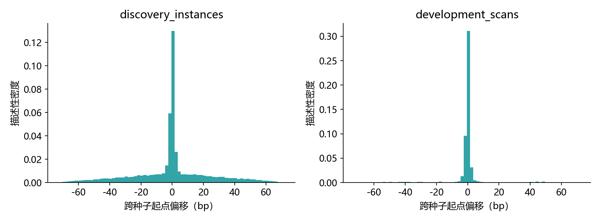

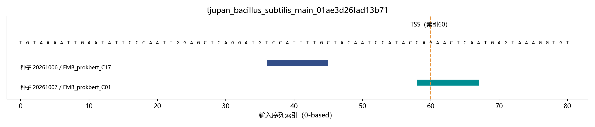

图 F11 按固定字典序选择首个偏移>10 bp 的真实 Discovery 片段案例，仅用于解释失败，不代表总体。

## 5. 天然对照、Shuffle 与 GC

六物种正序列的 GC 均值均低于天然负序列。下表是 sequence-level 的组成描述，不是组级显著性检验：

| source | split | positive_n | natural_n | positive_gc_mean | natural_gc_mean | difference_percentage_points | histogram_overlap_20_bins |
| --- | --- | --- | --- | --- | --- | --- | --- |
| tjupan_bacillus_subtilis | discovery | 473 | 559 | 0.3299 | 0.4605 | -13.0616 | 0.3028 |
| tjupan_bacillus_subtilis | development | 67 | 77 | 0.3271 | 0.4528 | -12.5713 | 0.3512 |
| tjupan_baumannii | discovery | 1099 | 959 | 0.3315 | 0.4134 | -8.1915 | 0.5195 |
| tjupan_baumannii | development | 162 | 130 | 0.3329 | 0.4063 | -7.3392 | 0.5875 |
| tjupan_bradyrhizobium | discovery | 1364 | 1383 | 0.6074 | 0.6497 | -4.2360 | 0.7410 |
| tjupan_bradyrhizobium | development | 171 | 168 | 0.5972 | 0.6501 | -5.2846 | 0.6815 |
| tjupan_diphtheria | discovery | 1186 | 1143 | 0.4650 | 0.5531 | -8.8175 | 0.5178 |
| tjupan_diphtheria | development | 156 | 167 | 0.4670 | 0.5434 | -7.6359 | 0.5088 |
| tjupan_escherichia_coli | discovery | 1143 | 1183 | 0.4420 | 0.5295 | -8.7515 | 0.5673 |
| tjupan_escherichia_coli | development | 163 | 167 | 0.4329 | 0.5179 | -8.4995 | 0.5552 |
| tjupan_staphylococcus | discovery | 1480 | 801 | 0.2575 | 0.3441 | -8.6581 | 0.4172 |
| tjupan_staphylococcus | development | 248 | 131 | 0.2521 | 0.3414 | -8.9347 | 0.4069 |

天然对照回答候选是否区别于现有非启动子样本；二核苷酸 Shuffle 更接近询问超出原有二核苷酸组成后是否仍有模式效应。两者效应量和显著性不同不构成矛盾，也不能归结为“Shuffle 太严格”或“全部都是 GC 假象”。

按组级均值 GC 固定分层 [0,.2,.4,.6,.8,1]，每层至少 5 个正组和 5 个天然负组，计算探索性 CMH pooled OR/p，并单独 BH。保留组覆盖比例、分层效应与未校正结果。仍有少数候选保留关联：

| method | exploratory_q_le_005 |
| --- | --- |
| STREME | 6 |
| onehot | 9 |
| prokbert | 3 |
| tokenwindow | 3 |

CMH 只控制粗粒度 GC 分层，不能控制二核苷酸结构、局部背景、物种内部来源偏差或反复选择；没有“GC 已解决”的结论。

旧主种子 Shuffle 族有 406 个检验，discordant groups 中位数 19。其中 113 个候选即使所有 discordant groups 都偏向正序列，条件下限 p=2^(-D) 仍大于首位 BH 阈值 .05/406。这只是可达到 p 值的条件边界；BH 后续排名的阈值不同，不能宣称这些候选绝无通过 BH 的可能，也不能把它称为事后检验功效或证明低功效解释了所有不显著。表中保存正独有 b、Shuffle 独有 c、(b-c)/N 效应量。

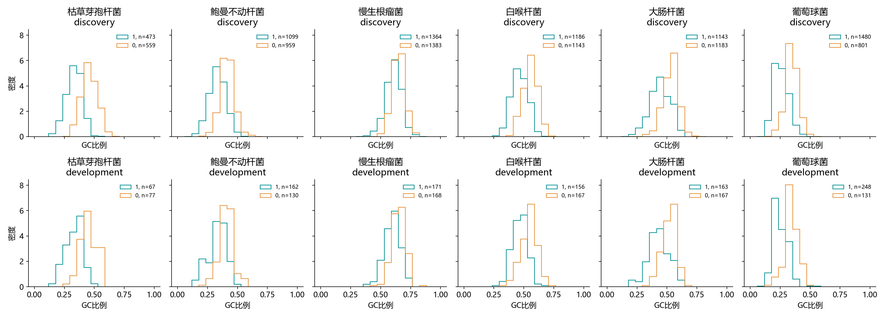

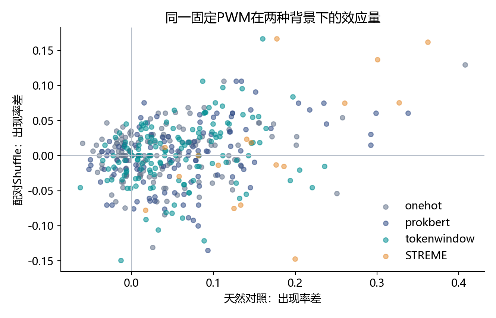

## 6. Pooling 改进及其代数诊断

设 token t 覆盖碱基区间 I_t，目标窗口 W。A0 先把 token 平均投射到每个碱基，再对 W 平均；其权重为 w0(t)=Σ[b∈W∩I_t] 1/(|W|·c_b)，c_b 为覆盖碱基 b 的 token 数。A1 只平均完整落在窗口内的 token。A2 按覆盖比例 |W∩I_t|/6 加权，再归一化。

当 W 中每个碱基均由六个 token 覆盖，w0(t)=|W∩I_t|/(6|W|)，与归一化的 A2 完全一致。81-bp 输入、10-bp 窗口共有 72 个位置，其中 62 个内部位置等价，只有两端各 5 个位置有真正权重差异。宽度 6 和 16 也通过代数与单元检查。

A1 限制的是参与聚合的 token 区间；上下文化 hidden state 仍可含窗口外信息。A2 同样不能普遍隔绝上下文。因此“定位不稳由窗口外信息导致”仍是假设，现有实验没有建立单一因果解释。边缘权重变化可以通过整体 PCA/聚类改变内部候选，不应把候选差异直接解释成局部窗口语义改善。

新增六物种 A0_recalc 主种子对照使用与 A2 相同的 einsum 路径重新实现 A0。六物种候选数均与原 A0 一致，匹配 PWM 相似度中位数均为 1.0；这降低了本组真实结果仅由实现路径数值差异造成的疑虑，不能作为生物学提升的证据。

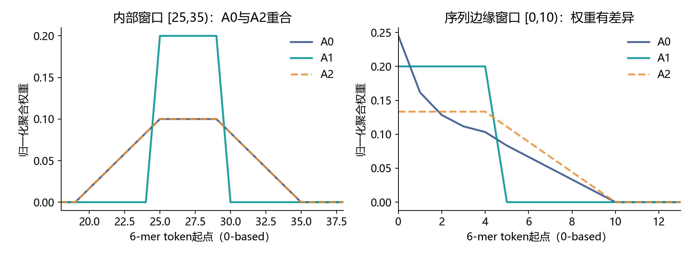

## 7. 合成难度梯度与独立 Test

九类条件：强模式固定位置；15%/30% 逐位替换；强模式随机位置；GC=.25/.75；两个 6-bp 模式固定 gap=17；gap=10–24；一阶持续性=.7 的 Markov 背景。每类三个种子 20261010/11/12，共 27 个数据条件。每个条件独立生成 Discovery 256、Development 128、Test 128 条正序列及对应空白对照，另有 256 条阈值校准对照。方法共享同一份序列；无反向链植入难度梯度。背景 GC 是生成参数，植入后的实际全序列 GC 可能变化。

单模式主窗口 10 bp、双模式 6 bp；随机强模式额外测 6/16 bp，四方法共 132 次拟合。相同簇预算 24、最低 20 条序列、每簇每序列一个建模窗口；合成实验不做真实数据的候选去重，故候选数量不能直接与真实数据比。

真值位置不进入 PCA/聚类/片段选择/PWM 构建。评价时用合成参考 PWM 与候选一对一匹配，cosine≥0.8 才计入恢复；这属于参考辅助的模式恢复评价，不能解释成无人监督发现的绝对 precision。参考 alignment 用于把短窗口扫描位点投射为植入模式起点；6-bp 窗口匹配 12-bp 模式只证明部分锚点定位，不证明完整 12-bp 边界恢复。

初始评价允许最小 6 列局部相似；在汇总指标前修正为至少覆盖 min(候选宽度,参考宽度)，避免把局部相似当作长模式恢复。所有方法统一重新评价已冻结 PWM，不重新拟合；旧宽松输出与初始源文件保留在 configs，严格规则见 `configs/strict_evaluation.json` 和 manifest。后续若利用这些 Test 结果改方法，应另用新种子作为独立 Test，不能继续把本 Test 当未查看的最终集。

TP 要求预测方向正确且起点误差不超过指定容差；precision 的分母包含植入正序列上的全部阳性预测及空白对照上的预测，位置错误记 FP 且对应真值未找回，recall 分母为所有植入位点。每个家族每条序列最多一个最大分预测。PWM 未过门槛记为 0；这不是 hidden state 完全没有相关信息的证明。

独立 Test、±2 bp、三个种子（双模式再对两家族平均）的 F1：

| scenario | OH | A0 | A1 | A2 |
| --- | --- | --- | --- | --- |
| S1_strong_fixed | 0.987 | 0.975 | 0.977 | 0.982 |
| S2_mut15_fixed | 0.840 | 0.000 | 0.000 | 0.000 |
| S2_mut30_fixed | 0.448 | 0.000 | 0.000 | 0.000 |
| S3_strong_random | 0.981 | 0.970 | 0.982 | 0.992 |
| S4_gc25_random | 0.968 | 0.971 | 0.960 | 0.971 |
| S4_gc75_random | 0.980 | 0.977 | 0.649 | 0.660 |
| S5_pair_fixed | 0.803 | 0.150 | 0.803 | 0.471 |
| S6_pair_variable | 0.811 | 0.651 | 0.811 | 0.793 |
| S7_markov_random | 0.991 | 0.659 | 0.991 | 0.655 |

随机强模式、10-bp 窗口中 A2 平均 F1 约 .992，A0 约 .970，One-hot 约 .981；但退化模式 A0/A1/A2 均未过严格 PWM 门槛，One-hot 在 15% 与 30% 替换条件约 .840/.448。16-bp 随机强模式 A0/A2 为 0，而 A1 约 .624、One-hot 约 .955。GC=.75 和 Markov 条件部分 Embedding 种子失败，均值必须结合 min/max 查看。只用一个强模式场景讲“改进成功”不成立。

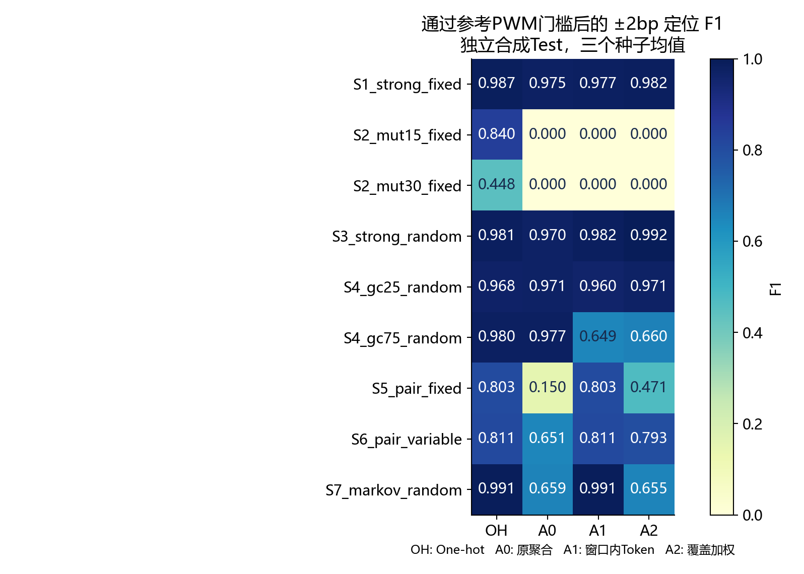

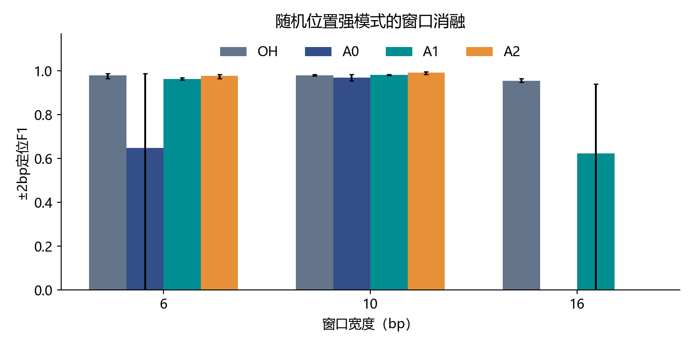

双模式 grammar 的总体分母为每方法每条件 384 条独立 Test 启动子。图 F09 只画双模式同时检出的点；漏检者仍在 `grammar_summary.tsv` 的总体正确顺序率和 gap±3 率分母内。固定 gap 条件 A0 未同时检出两模式；变化 gap 的较高描述性恢复不能证明真实启动子中存在相同调控机制，也不能假定固定 gap 一定更容易。

| scenario | method | test_pairs | both_detected | correct_order_rate_all_pairs | gap_within3_rate_all_pairs |
| --- | --- | --- | --- | --- | --- |
| S5_pair_fixed | OH | 384 | 254 | 0.6510 | 0.6458 |
| S5_pair_fixed | A0 | 384 | 0 | 0.0000 | 0.0000 |
| S5_pair_fixed | A1 | 384 | 254 | 0.6510 | 0.6458 |
| S5_pair_fixed | A2 | 384 | 119 | 0.2995 | 0.2969 |
| S6_pair_variable | OH | 384 | 256 | 0.6562 | 0.6536 |
| S6_pair_variable | A0 | 384 | 256 | 0.6562 | 0.6536 |
| S6_pair_variable | A1 | 384 | 256 | 0.6562 | 0.6536 |
| S6_pair_variable | A2 | 384 | 246 | 0.6302 | 0.6276 |

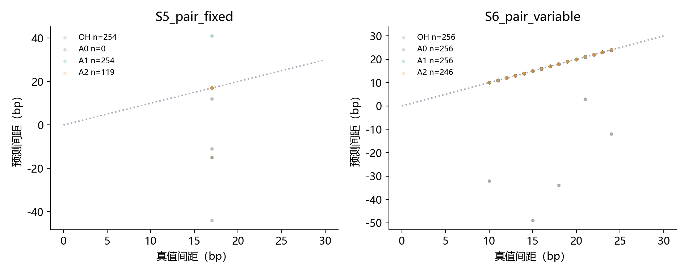

本轮合成矩阵没有重新执行 STREME；因此只能比较四种表示构造流程。真实数据 STREME 对照来自冻结主线。这是总体方法排名仍未闭合的一个限制。首轮 toy 的“合格候选数/纯度”和本轮的参考辅助定位 F1、数据种子不同，不能直接合并成单一提升曲线。

## 8. 六物种真实数据新增 A2 结果

新增 A2 六物种×三种子 18 次真实实验，另六次 A0_recalc 数值控制。主种子在新探索检验族下：

| source | candidates | significant_new_family | shuffle_significant |
| --- | --- | --- | --- |
| tjupan_bacillus_subtilis | 19 | 8 | 0 |
| tjupan_baumannii | 19 | 10 | 0 |
| tjupan_bradyrhizobium | 20 | 7 | 0 |
| tjupan_diphtheria | 22 | 10 | 0 |
| tjupan_escherichia_coli | 21 | 9 | 0 |
| tjupan_staphylococcus | 15 | 1 | 0 |

自然富集候选数不能直接评价额外发现价值，尤其候选间相互依赖且背景组成存在差异。A2 三种子全宽一对一 PWM 相似度中位数 0.9143，建模片段精确位置 Jaccard 中位数 0.0081；该汇总包含所有匹配家族，未套用前文 A0 cosine≥.8 筛选，因此不能据数值大小声称 A2 定位改善。

全部方法主种子新探索 q≤.05 的候选数（天然与 Shuffle 独立校正；只作描述）：

| source | method | natural | shuffle |
| --- | --- | --- | --- |
| tjupan_bacillus_subtilis | A0 | 10 | 0 |
| tjupan_bacillus_subtilis | A1 | 4 | 0 |
| tjupan_bacillus_subtilis | A2 | 8 | 0 |
| tjupan_bacillus_subtilis | OH | 4 | 0 |
| tjupan_bacillus_subtilis | STREME | 3 | 0 |
| tjupan_baumannii | A0 | 8 | 0 |
| tjupan_baumannii | A1 | 5 | 0 |
| tjupan_baumannii | A2 | 10 | 0 |
| tjupan_baumannii | OH | 6 | 0 |
| tjupan_baumannii | STREME | 2 | 0 |
| tjupan_bradyrhizobium | A0 | 5 | 0 |
| tjupan_bradyrhizobium | A1 | 8 | 0 |
| tjupan_bradyrhizobium | A2 | 7 | 0 |
| tjupan_bradyrhizobium | OH | 0 | 0 |
| tjupan_bradyrhizobium | STREME | 2 | 0 |
| tjupan_diphtheria | A0 | 10 | 0 |
| tjupan_diphtheria | A1 | 10 | 0 |
| tjupan_diphtheria | A2 | 10 | 0 |
| tjupan_diphtheria | OH | 2 | 0 |
| tjupan_diphtheria | STREME | 3 | 0 |
| tjupan_escherichia_coli | A0 | 6 | 0 |
| tjupan_escherichia_coli | A1 | 8 | 0 |
| tjupan_escherichia_coli | A2 | 9 | 0 |
| tjupan_escherichia_coli | OH | 2 | 0 |
| tjupan_escherichia_coli | STREME | 2 | 0 |
| tjupan_staphylococcus | A0 | 1 | 0 |
| tjupan_staphylococcus | A1 | 1 | 0 |
| tjupan_staphylococcus | A2 | 1 | 0 |
| tjupan_staphylococcus | OH | 14 | 0 |
| tjupan_staphylococcus | STREME | 2 | 0 |

对六物种 A2，各种子 Shuffle 均未得到 q≤.05 的候选。结合 One-hot、传统 STREME、定位稳定性和合成退化实验，当前只能说 A2 生成了可追溯 PWM，未证明可靠的额外发现价值。没有从真实 Development 得出召回率或准确率，因为不存在完整的真实位点真值。

## 9. 传统基线与生物学解释边界

传统主线已有双背景 STREME 12 个运行、17 个天然背景冻结主候选；后续严格 FIMO/参考库/grammar 报告优先于更早“下一步待做”的文案。本轮另用同一自定义最大分口径绘制 Development 的传统 PWM TSS 位置与配对 gap，仅为描述，不能称为严格 FIMO q 通过、−35/−10 调控确认或显著共现。

旧参考库的 4 个短参考矩阵文件当前缺失，只有元数据与历史报告可用。没有重新制造矩阵，也没有用大肠杆菌共识冒充六物种已知真值；新的数据库匹配结论暂缺。原主线严格检验没有支持显著 presence/cooccurrence 或可确认的位置间距机制，本轮图示不能推翻这一结论。

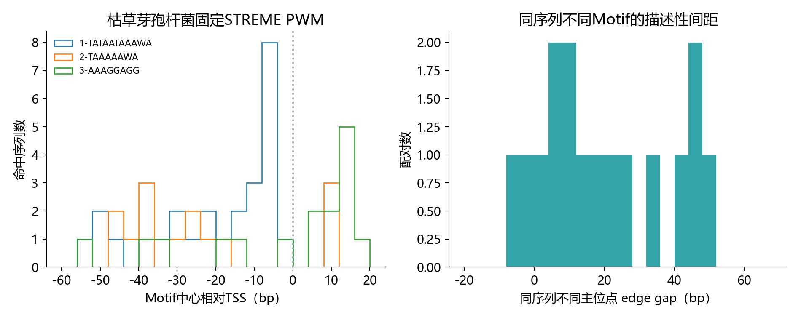

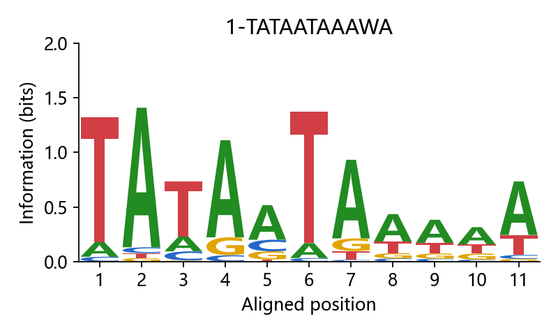

## 10. 可复现性、运行资源与核查

`protocol.json`、各 manifest、旧源文件快照、方法代码、逐实例与扫描表、参考匹配表均保留。manifest 记录真实输入/输出 SHA256、代码 SHA256、Git HEAD、依赖、CPU、开始时间、耗时与进程内存高水位。内存是顺序进程累计峰值，不能当作单个方法隔离峰值；真实 A2 不含首轮模型编码成本，不能拿这些秒数与端到端 STREME 时间直接比较。各记录耗时总和约 699.3 秒，亦不是本任务从开始到交付的墙钟时间。

复核结果：5626 项输入/输出哈希通过，53 个首轮运行输出未改；24 个新真实运行的 226456 条片段与坐标通过；132 个合成拟合的 535631 条片段及 16896 个植入真值通过；27 个合成条件跨 Discovery/Development/Test 与控制组无完全相同序列。7 项方法测试通过。哈希核查证实保存文件一致，不能独立重建每一次历史执行；没有新跑全量同源比对。

图表全部来自保存表格或明确标记的权重原理图；12 张已进行实际图片检查，F07 标签重叠已修正。图索引带源路径、统计单位、局限和图像哈希。

可复核命令（项目根目录）：

```powershell
python -m experiments.pr01_02_embedding_v2.next_round.verify_results
python -m pytest experiments/pr01_02_embedding_v2/test_pipeline.py experiments/pr01_02_embedding_v2/next_round/test_methods.py -q
python -m experiments.pr01_02_embedding_v2.next_round.figures
python -m experiments.pr01_02_embedding_v2.next_round.write_materials
```

原始拟合入口是 `next_round.real`、`next_round.benchmark`；它们拒绝覆盖已存在的 manifest/目录。重做实验应先复制代码到新的版本目录、指定新输出位置；不要删除当前证据直接重跑。仅绘图/汇总脚本允许重新生成派生材料。最终 inventory 为 `run_inventory_final.tsv`；早期 `run_inventory.tsv` 是汇总程序完成前快照，不能据其 RUNNING 判断实际状态。

## 11. 失败记录、未完成项与后续判据

已观察的限制包括：建模片段不稳定；严格退化模式未恢复；A2 主要内部等价；高 GC/相关背景下种子失败；双模式漏检；Shuffle 无可靠通过；真实位点真值不全；缺失参考矩阵；真实 Development 已反复查看。

A3 中心加权仅有实现定义，未运行；A4 局部片段重新编码、SAE、微调、反向链植入梯度、更多独立种子与新的 STREME 合成矩阵均未执行，不能写为成果。首轮部分状态仍为 PARTIAL；本轮完成的是这组诊断与比较，项目整体发现结论仍是部分完成。

后续优先做局部重新编码与全序列上下文的成对控制，保持窗口、片段选择和评价统一，以测试上下文来源假设；其次把初始表示选择与聚类选择分开诊断，并用新合成 Test 种子复核退化、宽度和种子失败。若要论证真实额外发现，应先恢复物种可靠参考矩阵/位点来源、预先锁定候选与独立验证族，再使用未查看的合适验证资源。增加模型数量不是充分的推进理由。

## 12. 两分钟汇报的准备边界

依据最新要求，主体只保留三页、总时长≤120秒。当前先交付完整研究基础、图表、问答与结论证据表，不把技术细节塞进课堂主体。之后三页压缩为：为什么尝试上下文表示；实际候选与定位/背景问题；已完成聚合诊断与条件性结果。旧“计划开展覆盖加权”应替换为本轮实测与等价性认识，结尾回到可靠启动子 Motif 的发现与验证。
