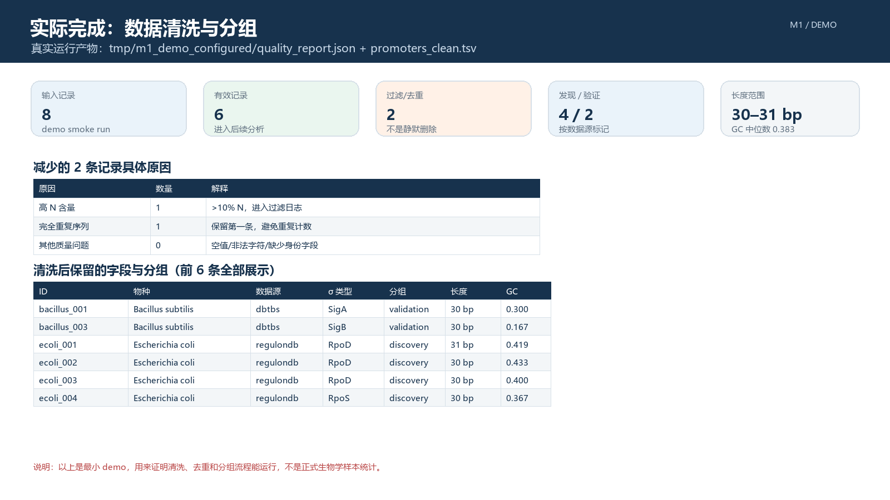
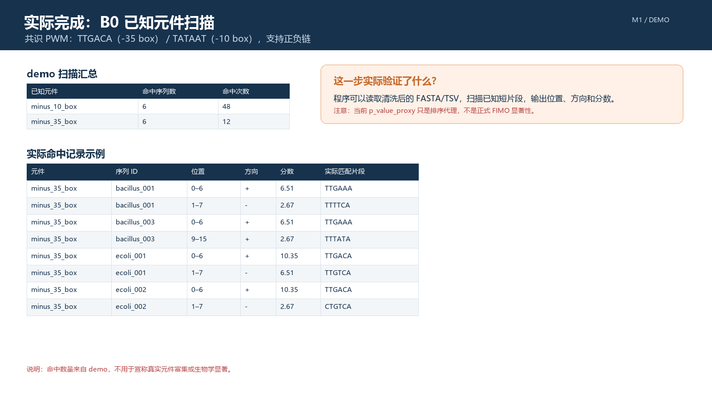
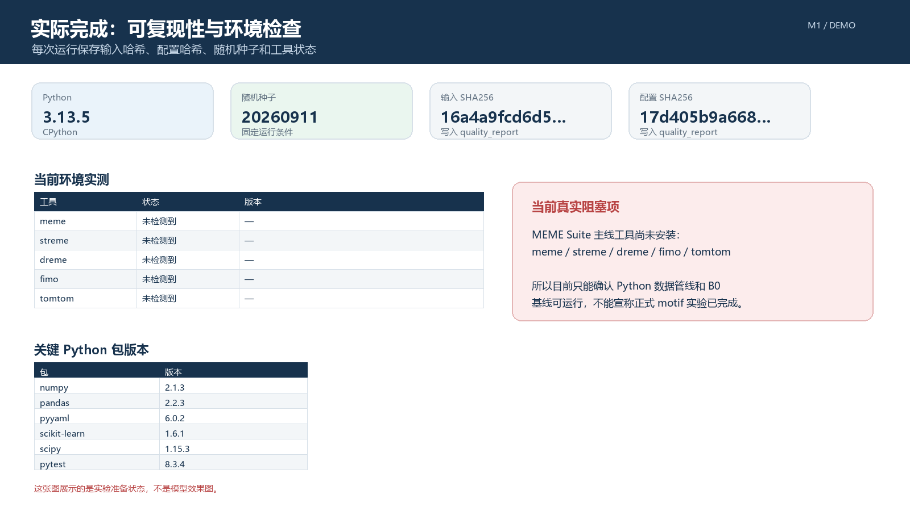

# 第一阶段汇报：我们要从启动子序列里找什么规律？

适合完全不了解项目的听众
建议时长：3–4 分钟
建议页数：6 页

> 这份材料只讲清楚“项目要解决什么问题、我们准备怎么做、目前做到哪一步”。下面出现的数字来自仓库里的小样本 demo，用来证明流程确实跑通；它们不是最终真实生物学结论。

---

## 第 1 页｜我们到底在做什么？

### 页面上写

我们研究的是：**启动子序列里的调控规律**。

启动子可以简单理解为：基因前面的一段“开关区域”。它决定基因什么时候开始工作、工作的强弱和对什么信号产生反应。

我们不做：

- 判断一段 DNA 是不是启动子；
- 预测启动子强度；
- 生成新的启动子。

我们要做的是：

> 从很多已经知道是启动子的 DNA 序列中，找出反复出现的短片段和排列规律。

### 讲解

我们的项目可以理解成“从大量启动子序列中找规律”。比如很多序列里可能都会出现一小段相似的字母组合，这种反复出现的短片段就叫 motif。我们还要看它出现在什么位置、和其他片段相隔多远，以及这种规律在不同物种中是否还存在。

---

## 第 2 页｜我们要回答三个问题

### 页面上写

**问题 1：** 找到的短片段，和已经知道的 `-10/-35 box` 是不是同一个规律？

**问题 2：** 不同 σ 因子负责的启动子，规律是不是不一样？

**问题 3：** 在一个数据集里找到的规律，换一个物种或数据集还能不能找到？

### 讲解

我们不会只说“模型找到了几个 motif”。第一个问题看它是否能找回已有的生物学知识；第二个问题看不同类型的启动子有没有自己的特点；第三个问题看结果是不是只对某一批数据有效，还是换一批数据仍然成立。

---

## 第 3 页｜我们把一条序列记录成什么？

### 页面上写

每条启动子数据不只保存一串 DNA，还保存：

- 来自哪个物种；
- 属于哪个 σ 因子类型；
- 来自哪个数据库；
- TSS，也就是基因开始转录的位置；
- 这个记录是实验验证的，还是推测出来的。

最后希望得到这样一条分析链：

**DNA 序列 → 找到短片段 → 标出位置 → 比较不同组 → 检查能否复现**

### 讲解

如果只保存 DNA 字符串，我们无法解释不同物种、不同 σ 因子之间的差别。所以我们把序列和这些背景信息一起保存。这样后面才能说清楚：某个规律出现在哪些物种、哪些 σ 因子和哪些数据来源里。

---

## 第 4 页｜我们准备怎么找规律？

### 页面上写

我们分几步推进：

1. 先用已知的 `-10/-35 box` 做基础检查；
2. 再让 MEME 从全部序列中寻找新的短片段；
3. 用 STREME/DREME 作为另一种寻找方法进行对照；
4. 按 σ 因子分组，比较不同组的规律；
5. 换物种、换数据集重新检查，确认规律是否稳定；
6. 用随机打乱的序列做对照，避免把随机现象当成规律。

### 讲解

第一步相当于先做一个已知答案的检查，看看位置和扫描流程是否正常。第二、三步是真正的 motif 发现。之后再做分组和独立验证。整个流程不是为了得到一个漂亮的图，而是要逐步证明这个规律确实存在、确实有差异，而且不是随机产生的。

---

## 第 5 页｜目前已经完成了什么？

### 页面上写

这次实际跑通的 demo 结果：

- 输入 **8 条**启动子记录，清洗后保留 **6 条**；
- 删除 **1 条 N 碱基比例过高**的记录，删除 **1 条完全重复序列**；
- 自动分成 **4 条 discovery** 和 **2 条 validation**；
- 物种分布为：大肠杆菌 **4 条**、枯草芽孢杆菌 **2 条**；
- 序列长度为 **30–31 bp**，GC 含量中位数为 **0.383**；
- 已知元件扫描跑通：`-10 box` 共 **48 个命中**，`-35 box` 共 **12 个命中**；
- 输入文件、配置文件、随机种子和运行环境都已写入 manifest；
- 自动化测试 **7/7 通过**。

这说明目前已经不只是“写了方案”，而是已经把一条小样本数据处理链完整跑通了：

**读取数据 → 清洗 → 分组 → 统计 → 已知元件扫描 → 生成可复现记录**

展示截图：

*图 1：8 条输入记录如何变成 6 条有效记录。*

*图 2：当前 B0 基础扫描的真实输出。这里是流程验证，不是正式 FIMO 显著性结果。*

### 讲解

现在完成的是“问题建模和实验基础设施”，不是最终生物学结论。为了让结果可核对，我们实际用仓库里的 8 条小样本跑了一遍。程序识别出 1 条 N 太多的记录和 1 条重复记录，最后保留 6 条，并且自动完成了 discovery/validation 分组、GC 统计和已知元件扫描。这个结果证明代码链条能运行，但不能说真实数据里已经发现了新的调控规律。

---

## 第 6 页｜接下来做什么？

### 页面上写

下一步按这个顺序进行：

**审计数据来源 → 接入真实数据 → 确定序列范围 → 安装实验工具 → 运行 MEME/FIMO → 比较和验证规律**

当前环境检查的实际结果是：

- Python 和数据处理依赖已经可以运行；
- `meme`、`streme`、`dreme`、`fimo`、`tomtom` 当前都没有检测到；
- 所以现在能确认的是数据链路和 B0 基础扫描，正式 motif 发现和显著性检验还没有开始。

*图 3：运行环境、版本、哈希和 MEME Suite 工具检查结果。*

当前还没有形成：

- 真实数据上的 motif 发现结果；
- MEME/FIMO 的正式显著性结果；
- 不同物种之间的最终比较结论。

### 讲解

所以第一阶段的结论是：我们已经把问题讲清楚了，也把数据处理、分组、基础扫描和复现记录搭好了，并用 8 条 demo 数据实际跑通。下一阶段才进入真实数据实验。我们会先确认数据来源、TSS 和分组是否可靠，再补齐 MEME Suite，最后回答前面的三个问题。

---

# 备查问题的简单回答

### 为什么不做分类？

因为我们要找的是启动子内部的规律，而不是判断它是不是启动子。

### motif 是什么？

就是很多启动子序列里反复出现的一小段相似 DNA 片段。

### 目前找到新规律了吗？

还没有。现在完成的是程序和建模，真实数据实验还没开始。

### 为什么要用随机序列做对照？

防止某些片段只是因为 GC 含量或随机组合而出现，并不是真正的调控规律。

### 第一阶段最重要的成果是什么？

把问题、数据、模型、评价方法和下一步实验顺序都明确下来，并且已经有可运行、可检查的代码框架。

---

# 最后一句

> 我们现在已经把“要找什么、怎么找、怎样证明找得可靠”讲清楚了，下一步就是把真实数据接进来，正式开始实验。
